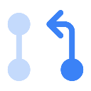

<a name="readme-top"></a>

<div align="center">
  
  <h2 align="center">PR Buddy</h2>
  <p align="center">
    AI-powered PR writer and reviewer for Azure DevOps
  </p>
</div>


## Overview

PR Buddy helps developers create and review pull requests in Azure DevOps using AI. It combines:

- **LangGraph AI Agents** for generating PR descriptions and code reviews
- **Chrome Extension** that seamlessly integrates with Azure DevOps

## Demo

https://github.com/user-attachments/assets/c5901fc6-63b0-4ccd-945b-d075782bfdbc


## Features

- 📝 **Generate PR Descriptions** - Create clear, professional PR documentation
- 🔍 **AI Code Reviews** - Get instant feedback on code quality and potential issues
- 🔄 **Azure DevOps Integration** - Works within your existing workflow

## Quick Start

### Backend Setup

1. Clone repository and install dependencies
   ```
   git clone https://github.com/tariqmassaoudi/pr-buddy.git
   cd prbuddy/backend
   Optionally set up a virtual environment Python >= 3.11.10 is required 
   pip install -r requirements.txt
   ```

2. Configure `.env` file with your credentials
   ```
   # Azure OpenAI Configuration
   AZURE_API_VERSION="your-version"
   AZURE_ENDPOINT="your-endpoint"
   AZURE_DEPLOYMENT="your-deployment"
   AZURE_MODEL="your-model"
   AZURE_API_KEY="your-key"
   
   # Azure DevOps Configuration
   AZURE_ORGANIZATION_URL="https://dev.azure.com/your-organization"
   AZURE_PERSONAL_ACCESS_TOKEN="your-pat"
   ```
3. Install the langgraph CLI
      ```
   pip install langgraph-cli
   or
   brew install langgraph-cli (if on macos)
   ```
   
5. Start LangGraph server
   ```
   langgraph dev
   ```

### Chrome Extension Setup

1. Build extension
   ```
   cd ../chrome-extension
   npm install
   npm run build
   ```

2. Load in Chrome:
   - Go to `chrome://extensions/`
   - Enable "Developer mode"
   - Click "Load unpacked" → select `dist` folder

## Usage

1. Navigate to an Azure DevOps PR
2. Use the extension popup to check connection status
3. Click "Write PR" to generate description or "Review PR" for code feedback


## License

MIT License

<p align="right">(<a href="#readme-top">back to top</a>)</p>
